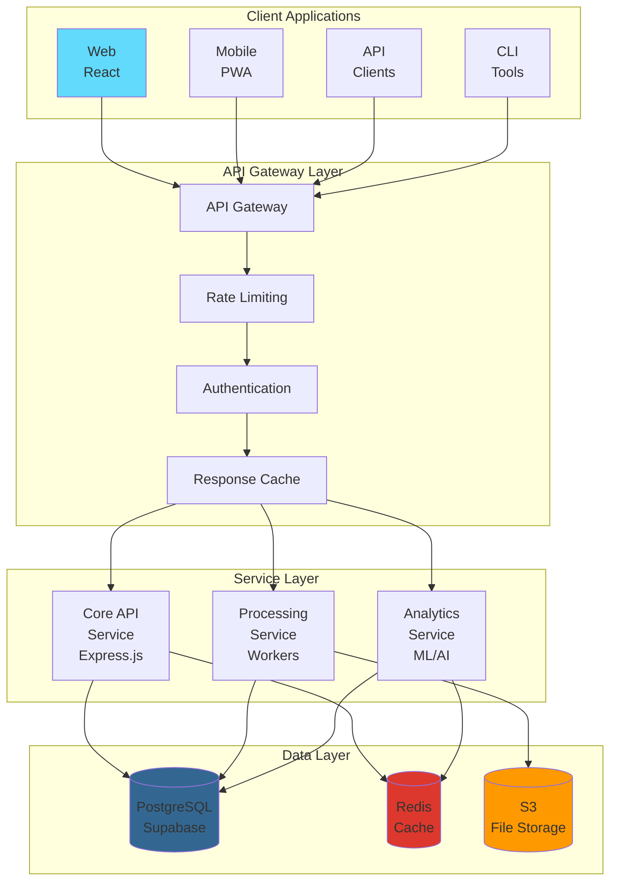
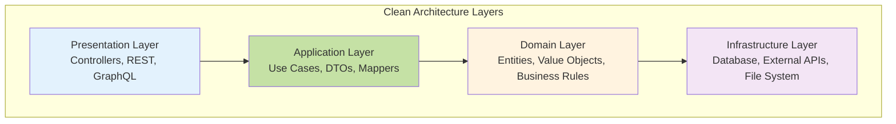
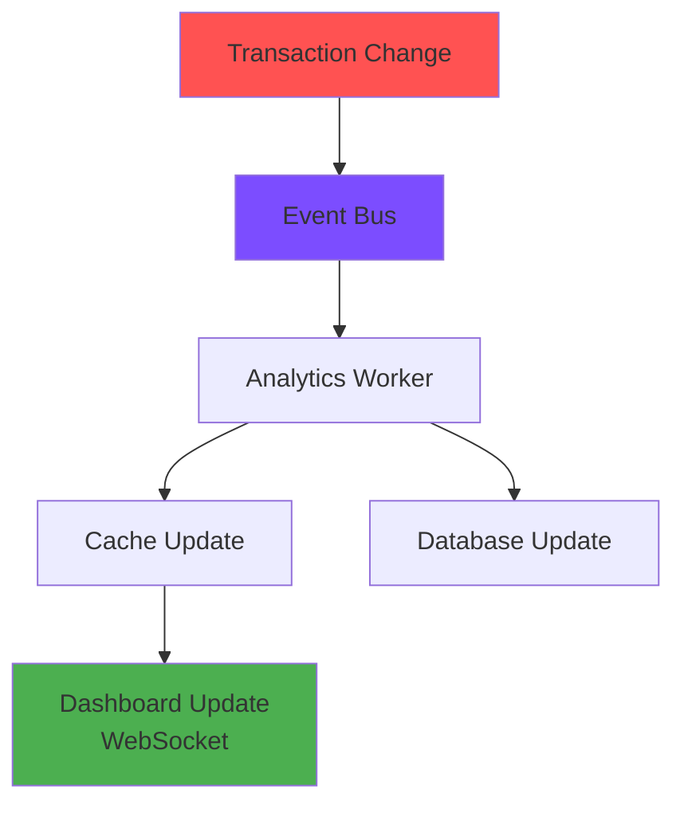
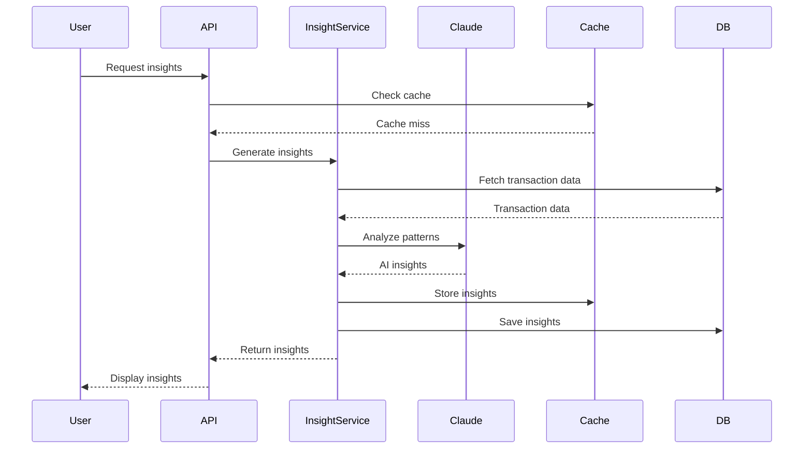
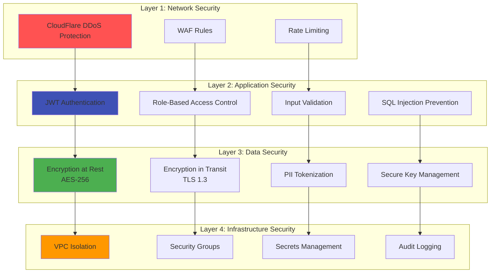

# 🏗️ Architecture Documentation

## Table of Contents
1. [System Overview](#system-overview)
2. [Architecture Principles](#architecture-principles)
3. [Component Architecture](#component-architecture)
4. [Data Flow](#data-flow)
5. [Technology Stack](#technology-stack)
6. [Security Architecture](#security-architecture)
7. [Performance Architecture](#performance-architecture)
8. [Scalability Design](#scalability-design)
9. [Integration Architecture](#integration-architecture)
10. [Decision Records](#decision-records)

## System Overview

Personal Finance Tracker follows a microservices-oriented architecture with clear separation of concerns, enabling independent scaling and deployment of components.

### High-Level Architecture



## Architecture Principles

### 1. Domain-Driven Design (DDD)

We organize code around business domains:

```
src/
├── domains/
│   ├── transactions/
│   │   ├── models/
│   │   ├── services/
│   │   ├── repositories/
│   │   └── controllers/
│   ├── analytics/
│   ├── budgets/
│   └── insights/
```

### 2. Clean Architecture



### 3. SOLID Principles

**Single Responsibility**
```typescript
// Good: Each class has one reason to change
class TransactionCategorizer {
  categorize(transaction: Transaction): Category { }
}

class TransactionValidator {
  validate(transaction: Transaction): ValidationResult { }
}
```

**Open/Closed**
```typescript
// Strategy pattern for extensibility
interface CategoryStrategy {
  categorize(transaction: Transaction): Category;
}

class MachineLearningStrategy implements CategoryStrategy { }
class RuleBasedStrategy implements CategoryStrategy { }
```

**Liskov Substitution**
```typescript
// Base classes can be replaced with derived classes
abstract class Parser {
  abstract parse(file: Buffer): Transaction[];
}

class CSVParser extends Parser { }
class PDFParser extends Parser { }
```

**Interface Segregation**
```typescript
// Focused interfaces
interface Readable {
  read(id: string): Promise<Entity>;
}

interface Writable {
  write(entity: Entity): Promise<void>;
}
```

**Dependency Inversion**
```typescript
// Depend on abstractions, not concretions
class TransactionService {
  constructor(
    private repository: ITransactionRepository,
    private categorizer: ICategorizer
  ) {}
}
```

## Component Architecture

### Frontend Architecture

```
src/frontend/
├── components/              # Reusable UI components
│   ├── common/             # Shared components
│   ├── dashboard/          # Dashboard-specific
│   └── transactions/       # Transaction-specific
├── hooks/                  # Custom React hooks
│   ├── useAuth.ts
│   ├── useTransactions.ts
│   └── useAnalytics.ts
├── services/               # API communication
│   ├── api.ts             # Base API service
│   ├── transactionService.ts
│   └── analyticsService.ts
├── store/                  # State management
│   ├── slices/
│   │   ├── authSlice.ts
│   │   └── transactionSlice.ts
│   └── store.ts
├── utils/                  # Utility functions
└── types/                  # TypeScript definitions
```

#### Component Design Pattern

```typescript
// Presentational Component
const TransactionCard: FC<TransactionCardProps> = ({ 
  transaction, 
  onEdit, 
  onDelete 
}) => {
  return (
    <Card>
      <CardHeader>{transaction.merchant}</CardHeader>
      <CardBody>
        <Amount value={transaction.amount} />
        <Category value={transaction.category} />
      </CardBody>
      <CardFooter>
        <Button onClick={() => onEdit(transaction.id)}>Edit</Button>
        <Button onClick={() => onDelete(transaction.id)}>Delete</Button>
      </CardFooter>
    </Card>
  );
};

// Container Component
const TransactionCardContainer: FC<{ id: string }> = ({ id }) => {
  const transaction = useTransaction(id);
  const { editTransaction, deleteTransaction } = useTransactionActions();
  
  return (
    <TransactionCard
      transaction={transaction}
      onEdit={editTransaction}
      onDelete={deleteTransaction}
    />
  );
};
```

### Backend Architecture

```
src/backend/
├── controllers/            # Request handlers
│   ├── transactionController.ts
│   └── analyticsController.ts
├── services/              # Business logic
│   ├── transactionService.ts
│   ├── categorizationService.ts
│   └── insightService.ts
├── repositories/          # Data access
│   ├── transactionRepository.ts
│   └── userRepository.ts
├── middleware/           # Express middleware
│   ├── authentication.ts
│   ├── validation.ts
│   └── errorHandler.ts
├── validators/           # Input validation
│   └── transactionValidator.ts
├── utils/               # Utilities
└── types/               # Type definitions
```

#### Service Layer Pattern

```typescript
// Service with dependency injection
export class TransactionService {
  constructor(
    private transactionRepo: ITransactionRepository,
    private categorizer: ICategorizer,
    private eventBus: IEventBus
  ) {}

  async createTransaction(data: CreateTransactionDTO): Promise<Transaction> {
    // Validate
    const validated = await this.validator.validate(data);
    
    // Business logic
    const category = await this.categorizer.categorize(validated);
    const transaction = new Transaction({
      ...validated,
      category
    });
    
    // Persist
    const saved = await this.transactionRepo.save(transaction);
    
    // Emit event
    await this.eventBus.emit('transaction.created', saved);
    
    return saved;
  }
}
```

### Processing Architecture

```
src/processing/
├── parsers/               # File parsers
│   ├── csvParser.ts
│   ├── pdfParser.ts
│   └── parserFactory.ts
├── categorizers/         # Categorization engines
│   ├── mlCategorizer.ts
│   ├── ruleCategorizer.ts
│   └── hybridCategorizer.ts
├── analyzers/           # Data analysis
│   ├── trendAnalyzer.ts
│   ├── anomalyDetector.ts
│   └── forecastEngine.ts
├── workers/            # Background jobs
│   ├── fileProcessor.ts
│   ├── insightGenerator.ts
│   └── reportBuilder.ts
└── ml/                # Machine learning
    ├── models/
    ├── training/
    └── inference/
```

#### Worker Queue Architecture

```typescript
// Job queue using Bull
import Bull from 'bull';

const fileProcessingQueue = new Bull('file-processing', {
  redis: {
    host: process.env.REDIS_HOST,
    port: process.env.REDIS_PORT
  }
});

// Producer
export const queueFileForProcessing = async (fileData: FileData) => {
  await fileProcessingQueue.add('process-file', fileData, {
    attempts: 3,
    backoff: {
      type: 'exponential',
      delay: 2000
    }
  });
};

// Consumer
fileProcessingQueue.process('process-file', async (job) => {
  const { fileId, format, userId } = job.data;
  
  // Process file
  const parser = ParserFactory.create(format);
  const transactions = await parser.parse(fileId);
  
  // Categorize
  const categorized = await categorizer.categorizeAll(transactions);
  
  // Save
  await transactionRepo.bulkSave(categorized);
  
  // Update progress
  await job.progress(100);
});
```

## Data Flow

### Transaction Upload Flow


### Real-time Analytics Flow



### AI Insights Flow



## Technology Stack

### Core Technologies

| Layer | Technology | Purpose |
|-------|------------|---------|
| **Frontend** | React 18 | UI framework |
| **State Management** | Redux Toolkit | Client state |
| **Styling** | Tailwind CSS | Utility-first CSS |
| **Backend** | Node.js + Express | API server |
| **Language** | TypeScript | Type safety |
| **Database** | PostgreSQL | Primary data store |
| **Cache** | Redis | Session & data cache |
| **Queue** | Bull | Job processing |
| **AI** | Claude API | Intelligent insights |

### Supporting Technologies

| Category | Technology | Purpose |
|----------|------------|---------|
| **Testing** | Jest, Cypress | Unit & E2E tests |
| **Monitoring** | Datadog | APM & logging |
| **CI/CD** | GitHub Actions | Automation |
| **Documentation** | TypeDoc | API docs |
| **Linting** | ESLint, Prettier | Code quality |
| **Build** | Vite, Webpack | Bundling |
| **Containerization** | Docker | Deployment |
| **Orchestration** | Kubernetes | Scaling |

## Security Architecture

### Defense in Depth



### Authentication Flow

```typescript
// JWT-based authentication
export class AuthService {
  async authenticate(credentials: Credentials): Promise<AuthToken> {
    // Validate credentials
    const user = await this.validateUser(credentials);
    
    // Generate tokens
    const accessToken = jwt.sign(
      { userId: user.id, roles: user.roles },
      process.env.JWT_SECRET,
      { expiresIn: '15m' }
    );
    
    const refreshToken = jwt.sign(
      { userId: user.id },
      process.env.REFRESH_SECRET,
      { expiresIn: '7d' }
    );
    
    // Store refresh token
    await this.storeRefreshToken(user.id, refreshToken);
    
    return { accessToken, refreshToken };
  }
}
```

### Data Encryption

```typescript
// Encryption service
export class EncryptionService {
  private algorithm = 'aes-256-gcm';
  private key = Buffer.from(process.env.ENCRYPTION_KEY, 'hex');

  encrypt(text: string): EncryptedData {
    const iv = crypto.randomBytes(16);
    const cipher = crypto.createCipheriv(this.algorithm, this.key, iv);
    
    let encrypted = cipher.update(text, 'utf8', 'hex');
    encrypted += cipher.final('hex');
    
    const authTag = cipher.getAuthTag();
    
    return {
      encrypted,
      iv: iv.toString('hex'),
      authTag: authTag.toString('hex')
    };
  }

  decrypt(data: EncryptedData): string {
    const decipher = crypto.createDecipheriv(
      this.algorithm,
      this.key,
      Buffer.from(data.iv, 'hex')
    );
    
    decipher.setAuthTag(Buffer.from(data.authTag, 'hex'));
    
    let decrypted = decipher.update(data.encrypted, 'hex', 'utf8');
    decrypted += decipher.final('utf8');
    
    return decrypted;
  }
}
```

## Performance Architecture

### Caching Strategy

```typescript
// Multi-level caching
export class CacheService {
  private memoryCache = new Map();
  private redisCache: Redis;

  async get<T>(key: string): Promise<T | null> {
    // L1: Memory cache
    if (this.memoryCache.has(key)) {
      return this.memoryCache.get(key);
    }

    // L2: Redis cache
    const cached = await this.redisCache.get(key);
    if (cached) {
      const parsed = JSON.parse(cached);
      this.memoryCache.set(key, parsed);
      return parsed;
    }

    return null;
  }

  async set<T>(key: string, value: T, ttl = 3600): Promise<void> {
    // Set in both caches
    this.memoryCache.set(key, value);
    await this.redisCache.setex(
      key,
      ttl,
      JSON.stringify(value)
    );
  }
}
```

### Database Optimization

```sql
-- Optimized indexes
CREATE INDEX idx_transactions_user_date 
ON transactions(user_id, transaction_date DESC);

CREATE INDEX idx_transactions_category 
ON transactions(category) 
WHERE category IS NOT NULL;

CREATE INDEX idx_transactions_amount 
ON transactions(amount) 
WHERE amount > 0;

-- Materialized view for analytics
CREATE MATERIALIZED VIEW monthly_summaries AS
SELECT 
  user_id,
  DATE_TRUNC('month', transaction_date) as month,
  category,
  SUM(amount) as total_amount,
  COUNT(*) as transaction_count
FROM transactions
GROUP BY user_id, month, category;

CREATE INDEX idx_monthly_summaries 
ON monthly_summaries(user_id, month);
```

### Query Optimization

```typescript
// Efficient pagination with cursor
export class TransactionRepository {
  async findPaginated(
    userId: string,
    cursor?: string,
    limit = 50
  ): Promise<PaginatedResult<Transaction>> {
    const query = this.db
      .select('*')
      .from('transactions')
      .where('user_id', userId)
      .orderBy('created_at', 'desc')
      .limit(limit + 1);

    if (cursor) {
      query.where('created_at', '<', cursor);
    }

    const results = await query;
    const hasMore = results.length > limit;
    const transactions = hasMore ? results.slice(0, -1) : results;

    return {
      data: transactions,
      cursor: transactions[transactions.length - 1]?.created_at,
      hasMore
    };
  }
}
```

## Scalability Design

### Horizontal Scaling

```yaml
# Kubernetes HPA configuration
apiVersion: autoscaling/v2
kind: HorizontalPodAutoscaler
metadata:
  name: api-hpa
spec:
  scaleTargetRef:
    apiVersion: apps/v1
    kind: Deployment
    name: api-deployment
  minReplicas: 3
  maxReplicas: 20
  metrics:
  - type: Resource
    resource:
      name: cpu
      target:
        type: Utilization
        averageUtilization: 70
  - type: Resource
    resource:
      name: memory
      target:
        type: Utilization
        averageUtilization: 80
  behavior:
    scaleUp:
      stabilizationWindowSeconds: 60
      policies:
      - type: Percent
        value: 100
        periodSeconds: 15
    scaleDown:
      stabilizationWindowSeconds: 300
      policies:
      - type: Percent
        value: 10
        periodSeconds: 60
```

### Database Sharding

```typescript
// Sharding strategy
export class ShardedRepository {
  private shards: Map<number, DatabaseConnection>;

  private getShardKey(userId: string): number {
    const hash = crypto
      .createHash('md5')
      .update(userId)
      .digest('hex');
    
    const shardCount = this.shards.size;
    return parseInt(hash.substring(0, 8), 16) % shardCount;
  }

  async query(userId: string, sql: string, params: any[]): Promise<any> {
    const shardKey = this.getShardKey(userId);
    const shard = this.shards.get(shardKey);
    return shard.query(sql, params);
  }
}
```

### Load Balancing

```nginx
# Nginx load balancer configuration
upstream api_servers {
    least_conn;
    server api1.internal:3200 weight=3;
    server api2.internal:3200 weight=3;
    server api3.internal:3200 weight=2;
    
    keepalive 32;
}

server {
    listen 80;
    server_name api.financetracker.io;

    location / {
        proxy_pass http://api_servers;
        proxy_http_version 1.1;
        proxy_set_header Upgrade $http_upgrade;
        proxy_set_header Connection "upgrade";
        proxy_set_header Host $host;
        proxy_set_header X-Real-IP $remote_addr;
        proxy_set_header X-Forwarded-For $proxy_add_x_forwarded_for;
        proxy_set_header X-Forwarded-Proto $scheme;
        
        # Circuit breaker
        proxy_next_upstream error timeout http_502 http_503 http_504;
        proxy_next_upstream_tries 3;
        proxy_connect_timeout 5s;
        proxy_read_timeout 60s;
    }
}
```

## Integration Architecture

### Bank API Integration

```typescript
// Adapter pattern for bank integrations
interface BankAdapter {
  connect(): Promise<void>;
  getTransactions(dateRange: DateRange): Promise<Transaction[]>;
  getBalance(): Promise<Balance>;
}

class PlaidAdapter implements BankAdapter {
  async connect(): Promise<void> {
    // Plaid-specific connection logic
  }
  
  async getTransactions(dateRange: DateRange): Promise<Transaction[]> {
    const plaidTransactions = await this.plaidClient.getTransactions(dateRange);
    return plaidTransactions.map(this.mapToTransaction);
  }
}

class YodleeAdapter implements BankAdapter {
  // Yodlee-specific implementation
}

// Factory for creating adapters
export class BankAdapterFactory {
  static create(provider: string): BankAdapter {
    switch (provider) {
      case 'plaid':
        return new PlaidAdapter();
      case 'yodlee':
        return new YodleeAdapter();
      default:
        throw new Error(`Unknown provider: ${provider}`);
    }
  }
}
```

### Event-Driven Architecture

```typescript
// Event bus implementation
export class EventBus {
  private handlers = new Map<string, Set<EventHandler>>();

  on(event: string, handler: EventHandler): void {
    if (!this.handlers.has(event)) {
      this.handlers.set(event, new Set());
    }
    this.handlers.get(event)!.add(handler);
  }

  async emit(event: string, data: any): Promise<void> {
    const handlers = this.handlers.get(event);
    if (!handlers) return;

    await Promise.all(
      Array.from(handlers).map(handler => 
        handler(data).catch(console.error)
      )
    );
  }
}

// Event handlers
eventBus.on('transaction.created', async (transaction) => {
  await analyticsService.updateMetrics(transaction);
  await insightService.checkForPatterns(transaction);
  await notificationService.checkAlerts(transaction);
});
```

### Webhook System

```typescript
// Webhook delivery system
export class WebhookService {
  async deliver(webhook: Webhook, payload: any): Promise<void> {
    const signature = this.generateSignature(payload, webhook.secret);
    
    const response = await fetch(webhook.url, {
      method: 'POST',
      headers: {
        'Content-Type': 'application/json',
        'X-Signature': signature,
        'X-Timestamp': Date.now().toString()
      },
      body: JSON.stringify(payload)
    });

    if (!response.ok) {
      await this.retryWithBackoff(webhook, payload);
    }
  }

  private async retryWithBackoff(
    webhook: Webhook, 
    payload: any, 
    attempt = 1
  ): Promise<void> {
    if (attempt > 5) {
      await this.markWebhookFailed(webhook);
      return;
    }

    const delay = Math.pow(2, attempt) * 1000;
    await new Promise(r => setTimeout(r, delay));
    
    try {
      await this.deliver(webhook, payload);
    } catch {
      await this.retryWithBackoff(webhook, payload, attempt + 1);
    }
  }
}
```

## Decision Records

### ADR-001: TypeScript Adoption

**Status**: Accepted  
**Date**: 2024-01-01

**Context**: Need for better type safety and developer experience.

**Decision**: Use TypeScript for all new code.

**Consequences**:
- ✅ Better type safety
- ✅ Improved IDE support
- ✅ Easier refactoring
- ⚠️ Additional build step
- ⚠️ Learning curve for team

### ADR-002: Microservices vs Monolith

**Status**: Accepted  
**Date**: 2024-01-05

**Context**: Need to balance complexity with scalability.

**Decision**: Start with modular monolith, prepare for microservices.

**Consequences**:
- ✅ Simpler deployment initially
- ✅ Easier debugging
- ✅ Can split later if needed
- ⚠️ Potential scaling limitations
- ⚠️ Need careful module boundaries

### ADR-003: Database Choice

**Status**: Accepted  
**Date**: 2024-01-10

**Context**: Need reliable, scalable database with good ecosystem.

**Decision**: PostgreSQL with Supabase for managed hosting.

**Consequences**:
- ✅ Mature, reliable database
- ✅ Rich feature set
- ✅ Managed hosting available
- ⚠️ Not as scalable as NoSQL
- ⚠️ Schema migrations needed

### ADR-004: AI Provider

**Status**: Accepted  
**Date**: 2024-01-15

**Context**: Need intelligent insights and categorization.

**Decision**: Claude API for primary AI, fallback to GPT-4.

**Consequences**:
- ✅ High-quality insights
- ✅ Good categorization accuracy
- ✅ Reliable API
- ⚠️ API costs
- ⚠️ Vendor dependency

## Monitoring & Observability

### Logging Strategy

```typescript
// Structured logging with correlation IDs
export class Logger {
  private correlationId: string;

  constructor(correlationId?: string) {
    this.correlationId = correlationId || uuid();
  }

  info(message: string, meta?: any): void {
    console.log(JSON.stringify({
      timestamp: new Date().toISOString(),
      level: 'info',
      correlationId: this.correlationId,
      message,
      ...meta
    }));
  }

  error(message: string, error: Error, meta?: any): void {
    console.error(JSON.stringify({
      timestamp: new Date().toISOString(),
      level: 'error',
      correlationId: this.correlationId,
      message,
      error: {
        message: error.message,
        stack: error.stack
      },
      ...meta
    }));
  }
}
```

### Metrics Collection

```typescript
// Prometheus metrics
import { register, Counter, Histogram, Gauge } from 'prom-client';

export const metrics = {
  httpRequestDuration: new Histogram({
    name: 'http_request_duration_seconds',
    help: 'Duration of HTTP requests in seconds',
    labelNames: ['method', 'route', 'status']
  }),

  transactionProcessed: new Counter({
    name: 'transactions_processed_total',
    help: 'Total number of transactions processed',
    labelNames: ['status', 'category']
  }),

  activeUsers: new Gauge({
    name: 'active_users',
    help: 'Number of active users',
    labelNames: ['plan']
  })
};

// Middleware to collect metrics
export const metricsMiddleware = (req, res, next) => {
  const start = Date.now();
  
  res.on('finish', () => {
    const duration = (Date.now() - start) / 1000;
    metrics.httpRequestDuration
      .labels(req.method, req.route?.path || 'unknown', res.statusCode)
      .observe(duration);
  });
  
  next();
};
```

### Distributed Tracing

```typescript
// OpenTelemetry tracing
import { trace, context, SpanKind } from '@opentelemetry/api';

const tracer = trace.getTracer('finance-tracker', '1.0.0');

export function traced<T>(
  name: string,
  fn: () => Promise<T>
): Promise<T> {
  return tracer.startActiveSpan(name, async (span) => {
    try {
      const result = await fn();
      span.setStatus({ code: 0 });
      return result;
    } catch (error) {
      span.recordException(error);
      span.setStatus({ code: 2, message: error.message });
      throw error;
    } finally {
      span.end();
    }
  });
}

// Usage
const processTransaction = (data) => traced('processTransaction', async () => {
  const validated = await traced('validateTransaction', () => 
    validator.validate(data)
  );
  
  const categorized = await traced('categorizeTransaction', () =>
    categorizer.categorize(validated)
  );
  
  return await traced('saveTransaction', () =>
    repository.save(categorized)
  );
});
```

---

## Appendix

### Glossary

| Term | Definition |
|------|------------|
| **DTO** | Data Transfer Object |
| **DDD** | Domain-Driven Design |
| **CQRS** | Command Query Responsibility Segregation |
| **JWT** | JSON Web Token |
| **HPA** | Horizontal Pod Autoscaler |
| **APM** | Application Performance Monitoring |
| **TTL** | Time To Live |
| **RTO** | Recovery Time Objective |
| **RPO** | Recovery Point Objective |

### References

- [Clean Architecture](https://blog.cleancoder.com/uncle-bob/2012/08/13/the-clean-architecture.html)
- [Domain-Driven Design](https://martinfowler.com/tags/domain%20driven%20design.html)
- [Microservices Patterns](https://microservices.io/patterns/)
- [12 Factor App](https://12factor.net/)

---

*Architecture Documentation v1.0.0 | Last Updated: January 2025*