# 📊 System Diagrams

## User Journey Flow

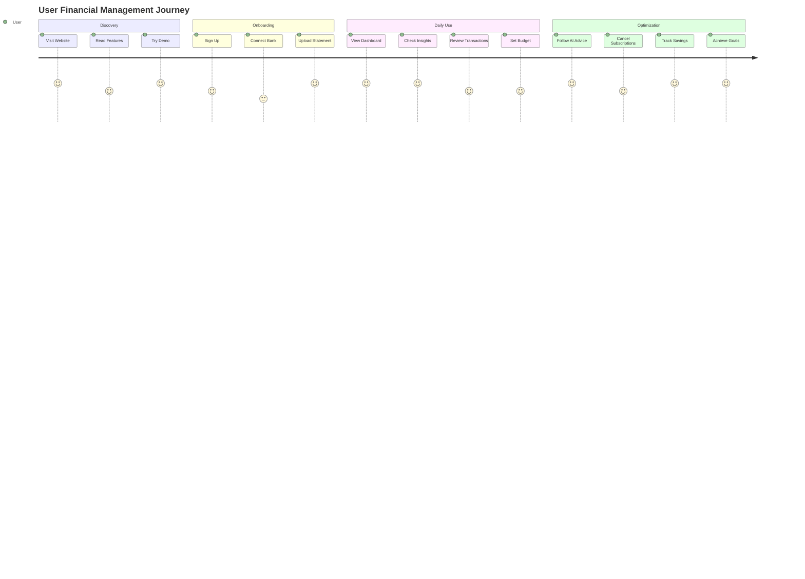

## Database Schema

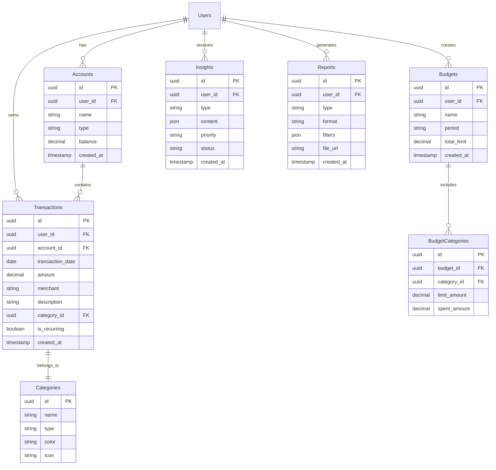

## State Management Flow

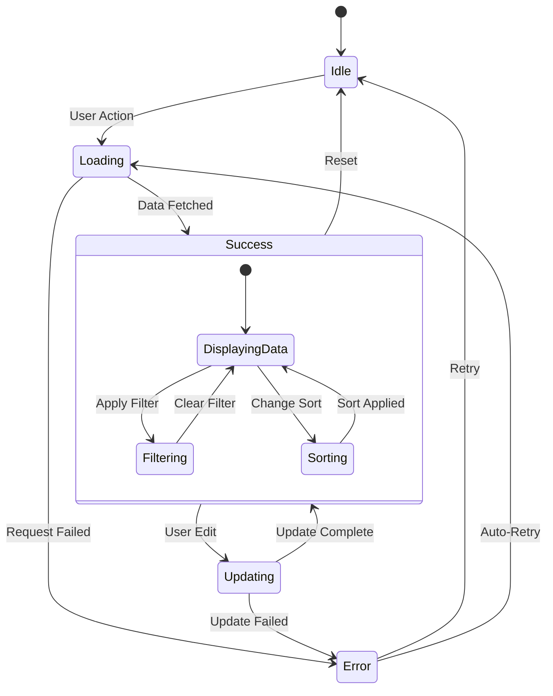

## CI/CD Pipeline

```mermaid
flowchart LR
    subgraph "Development"
        Dev[Developer] --> Commit[Git Commit]
        Commit --> PR[Pull Request]
    end
    
    subgraph "CI Pipeline"
        PR --> Lint[ESLint]
        Lint --> Tests[Jest Tests]
        Tests --> Build[Build App]
        Build --> E2E[E2E Tests]
        E2E --> Security[Security Scan]
    end
    
    subgraph "CD Pipeline"
        Security --> Staging[Deploy Staging]
        Staging --> StagingTests[Staging Tests]
        StagingTests --> Approval[Manual Approval]
        Approval --> Production[Deploy Production]
        Production --> Monitoring[Monitor]
    end
    
    style Dev fill:#4caf50
    style Tests fill:#2196f3
    style Production fill:#ff9800
```

## Authentication Flow

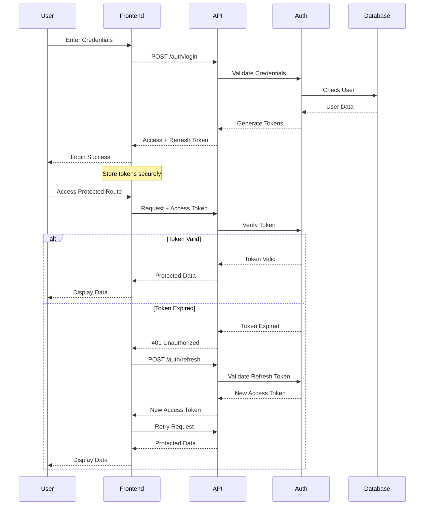

## Transaction Processing Pipeline

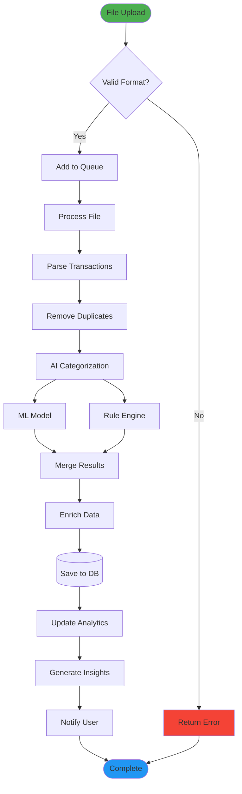

## Budget Tracking System

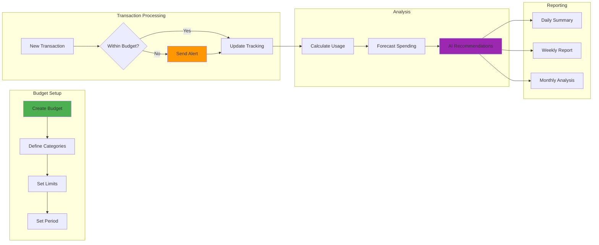

## Microservices Communication

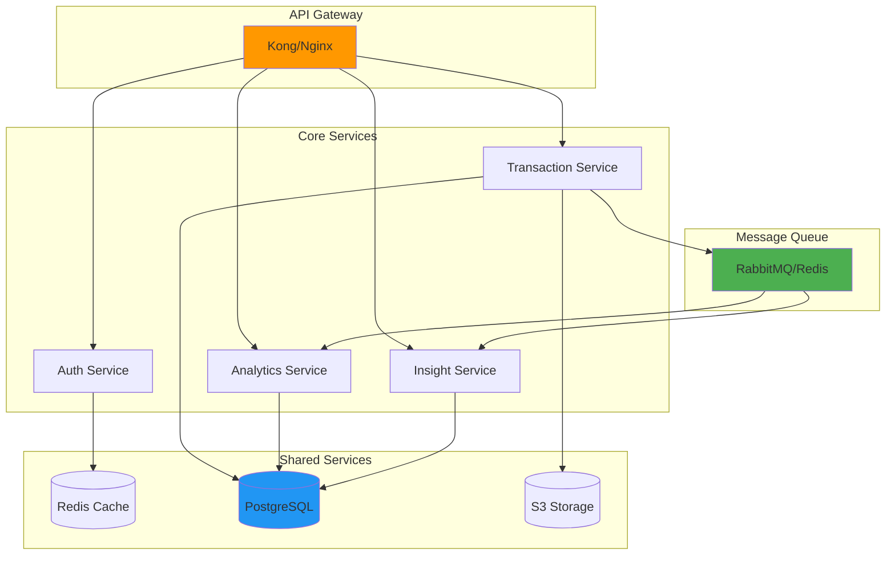

## Performance Monitoring Dashboard

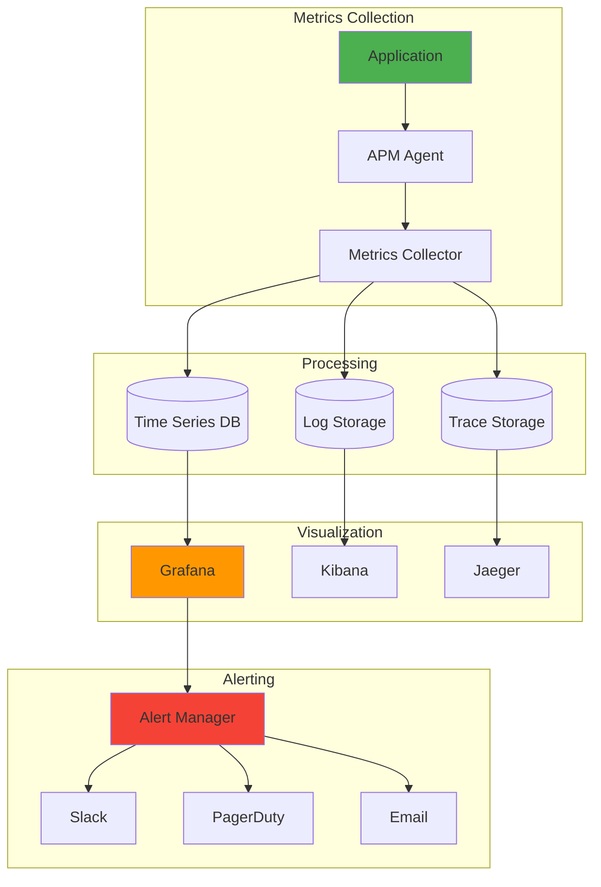

## Data Privacy & Compliance

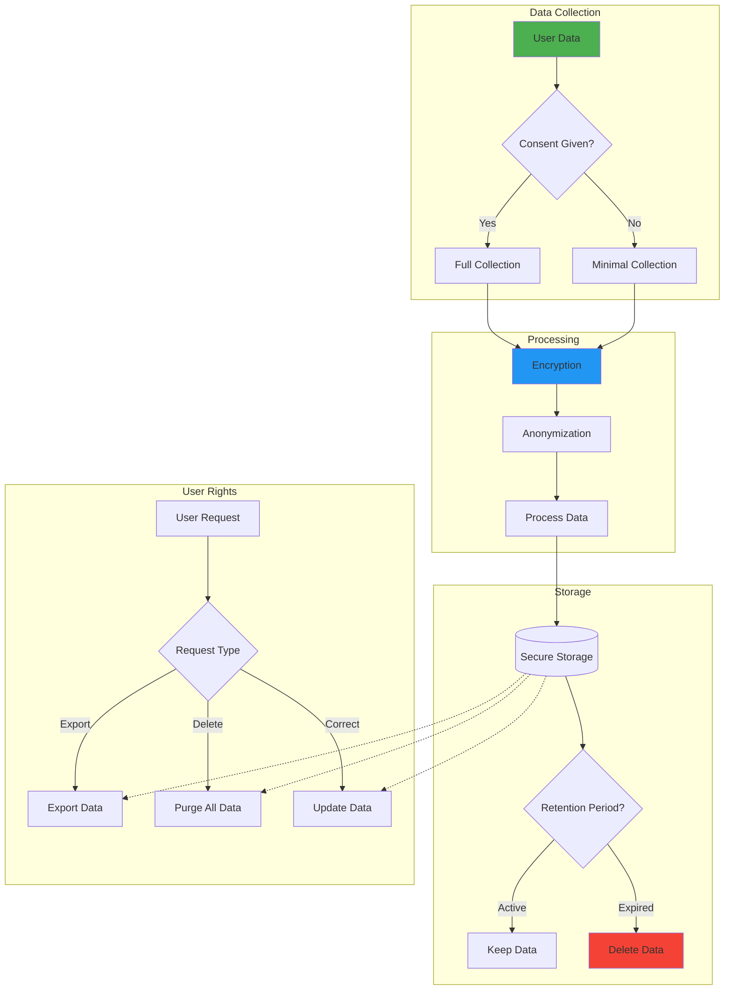

## Scaling Strategy

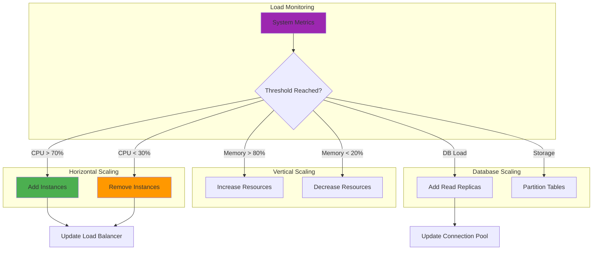

## Error Handling Flow

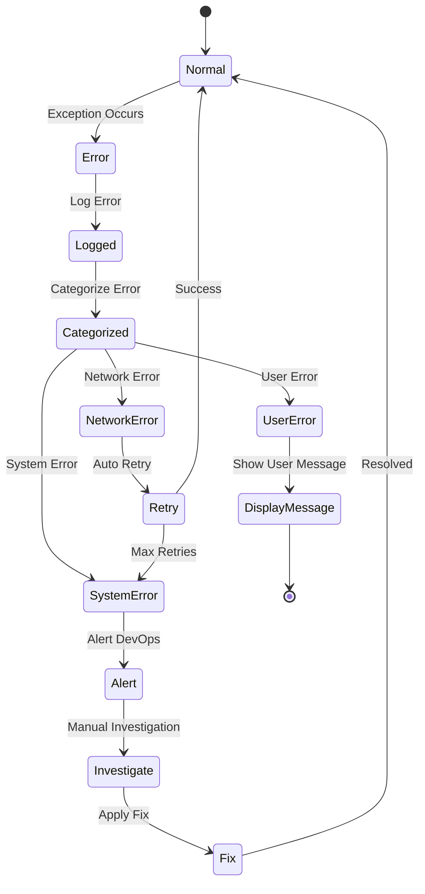

## Feature Rollout Strategy

```mermaid
graph LR
    subgraph "Development"
        Feature[New Feature] --> Test[Testing]
        Test --> Ready[Ready for Release]
    end
    
    subgraph "Rollout Phases"
        Ready --> Internal[1% Internal Users]
        Internal --> Beta[5% Beta Users]
        Beta --> Limited[20% Users]
        Limited --> Half[50% Users]
        Half --> Full[100% Users]
    end
    
    subgraph "Monitoring"
        Internal --> Monitor1[Monitor Metrics]
        Beta --> Monitor2[Monitor Metrics]
        Limited --> Monitor3[Monitor Metrics]
        Half --> Monitor4[Monitor Metrics]
        Full --> Monitor5[Monitor Metrics]
    end
    
    subgraph "Rollback"
        Monitor1 --> Rollback{Issues?}
        Monitor2 --> Rollback
        Monitor3 --> Rollback
        Monitor4 --> Rollback
        Monitor5 --> Rollback
        Rollback -->|Yes| Previous[Previous Version]
        Rollback -->|No| Continue[Continue]
    end
    
    style Feature fill:#4caf50
    style Full fill:#2196f3
    style Rollback fill:#ff9800
```

---

*System Diagrams v1.0.0 | Last Updated: January 2025*