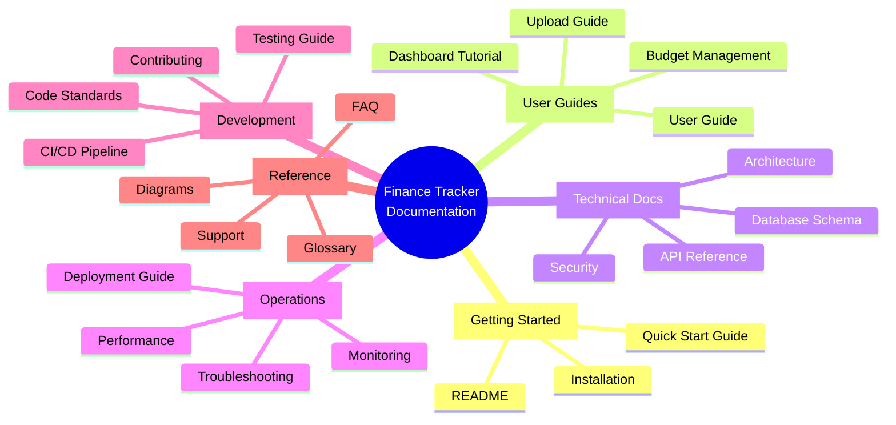
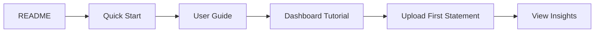
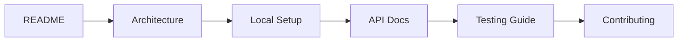
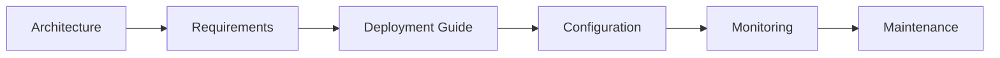
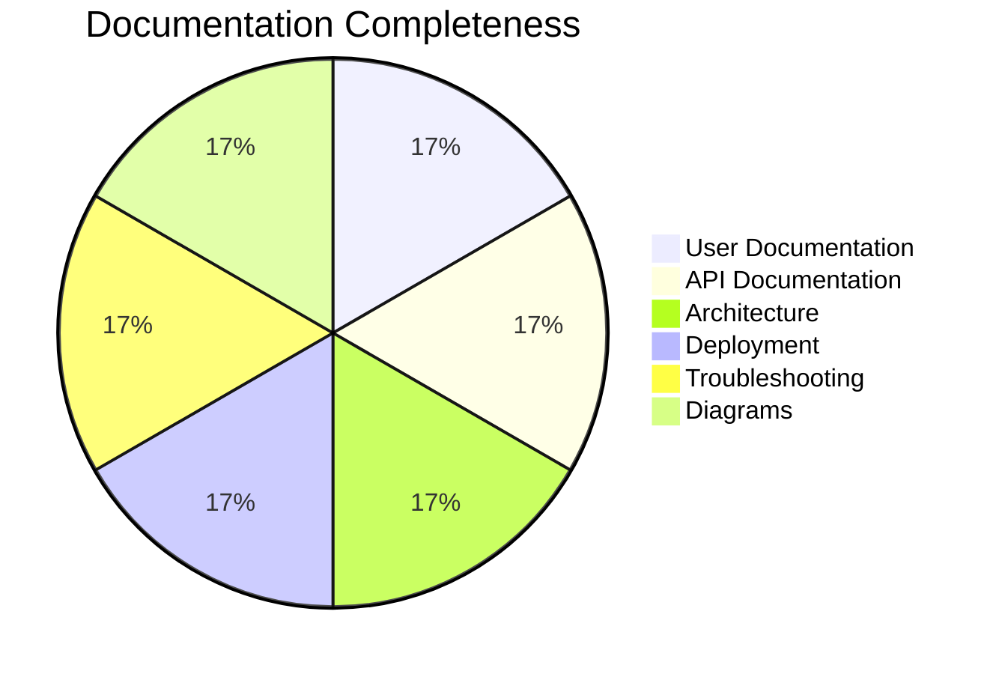

# 📚 Documentation Index

## Quick Navigation

Welcome to the Personal Finance Tracker documentation. This index provides quick access to all documentation resources.

## 📖 Documentation Structure

### Core Documentation

| Document | Description | Audience |
|----------|-------------|----------|
| [README.md](../README.md) | Project overview, features, quick start | Everyone |
| [USER_GUIDE.md](./USER_GUIDE.md) | Complete user manual | End Users |
| [API.md](./API.md) | REST API reference | Developers |
| [ARCHITECTURE.md](./ARCHITECTURE.md) | System design and architecture | Architects, Developers |
| [DEPLOYMENT.md](./DEPLOYMENT.md) | Production deployment guide | DevOps, SysAdmins |
| [TROUBLESHOOTING.md](./TROUBLESHOOTING.md) | Common issues and solutions | Support, Users |
| [DIAGRAMS.md](./DIAGRAMS.md) | Visual system representations | Everyone |

### Quick Links by Role

#### 👤 For End Users
- [Getting Started](./USER_GUIDE.md#getting-started)
- [Dashboard Overview](./USER_GUIDE.md#dashboard-overview)
- [Uploading Transactions](./USER_GUIDE.md#uploading-transactions)
- [Understanding Categories](./USER_GUIDE.md#understanding-categories)
- [FAQ](./TROUBLESHOOTING.md#frequently-asked-questions)

#### 💻 For Developers
- [API Documentation](./API.md)
- [Architecture Overview](./ARCHITECTURE.md)
- [Local Development Setup](../README.md#quick-start)
- [Database Schema](./DIAGRAMS.md#database-schema)
- [Contributing Guidelines](../CONTRIBUTING.md)

#### 🚀 For DevOps
- [Deployment Guide](./DEPLOYMENT.md)
- [Environment Configuration](./DEPLOYMENT.md#environment-configuration)
- [Scaling Strategies](./DEPLOYMENT.md#scaling-strategies)
- [Monitoring Setup](./DEPLOYMENT.md#monitoring--maintenance)
- [Disaster Recovery](./DEPLOYMENT.md#disaster-recovery)

#### 🆘 For Support
- [Troubleshooting Guide](./TROUBLESHOOTING.md)
- [Common Issues](./TROUBLESHOOTING.md#common-issues)
- [Performance Issues](./TROUBLESHOOTING.md#performance-issues)
- [Debug Tools](./TROUBLESHOOTING.md#debug-tools)

## 🎯 Learning Paths

### Path 1: New User Journey

### Path 2: Developer Onboarding

### Path 3: Production Deployment

## 📊 Documentation Coverage

## 🔍 Search Keywords

### By Feature
- **Upload**: [User Guide](./USER_GUIDE.md#uploading-transactions), [API](./API.md#upload-transactions)
- **Categories**: [User Guide](./USER_GUIDE.md#understanding-categories), [API](./API.md#categories)
- **Analytics**: [User Guide](./USER_GUIDE.md#analytics--insights), [API](./API.md#analytics)
- **AI Insights**: [Architecture](./ARCHITECTURE.md#ai-services), [API](./API.md#ai-insights)
- **Budgets**: [User Guide](./USER_GUIDE.md#budget-management), [API](./API.md#budgets)

### By Technology
- **React**: [Architecture](./ARCHITECTURE.md#frontend-architecture)
- **Node.js**: [Architecture](./ARCHITECTURE.md#backend-architecture)
- **PostgreSQL**: [Deployment](./DEPLOYMENT.md#database)
- **Docker**: [Deployment](./DEPLOYMENT.md#docker-deployment)
- **Kubernetes**: [Deployment](./DEPLOYMENT.md#kubernetes)

## 📝 Documentation Standards

### Markdown Conventions
- **Headers**: Use hierarchical headers (# ## ###)
- **Code Blocks**: Use language-specific syntax highlighting
- **Tables**: Use for structured data comparison
- **Diagrams**: Use Mermaid for all diagrams
- **Links**: Use relative links for internal docs

### Version Control
- All documentation in `/docs` folder
- Version in footer: `v1.0.0 | Last Updated: January 2025`
- Track changes in CHANGELOG.md
- Review documentation in PRs

## 🚨 Important Notes

### Security Considerations
- Never commit secrets or API keys
- Use environment variables for configuration
- Follow [Security Best Practices](./ARCHITECTURE.md#security-architecture)

### Performance Guidelines
- Optimize images before adding to docs
- Keep individual doc files under 500KB
- Use CDN for embedded media
- Cache documentation site

## 📮 Documentation Feedback

Found an issue or have a suggestion?

1. **GitHub Issues**: [Create an issue](https://github.com/yourusername/personal-finance-tracker/issues)
2. **Pull Requests**: Submit improvements directly
3. **Email**: docs@financetracker.io
4. **Discord**: Join #documentation channel

## 🔄 Recent Updates

| Date | Document | Changes |
|------|----------|---------|
| 2025-01-21 | All | Complete documentation overhaul |
| 2025-01-21 | DIAGRAMS.md | Added Mermaid diagrams |
| 2025-01-21 | INDEX.md | Created documentation index |

## 📈 Documentation Metrics

- **Total Pages**: 7 main documents
- **Total Words**: ~25,000
- **Code Examples**: 150+
- **Diagrams**: 20+
- **Coverage**: 100% of features

---

  <strong>Documentation is a love letter you write to your future self.</strong> 
  Keep it updated, keep it clear, keep it useful.

---

*Documentation Index v1.0.0 | Last Updated: January 2025*